# Agile

## Table of contents

1. [Agile Frist Phase](#agile-frist-phase)
1. [Agile Second Phase](#agile-second-phase)
1. [Agile Third Phase](#agile-third-phase)
1. [Agile Fourth Phase](#agile-fourth-phase)
1. [Agile Fifth Phase](#agile-fifth-phase)
1. [Agile Sixth Phase](#agile-sixth-phase)
1. [Agile Seventh Phase](#agile-seventh-phase)

## Agile Frist Phase

At the beginning of any project, it's essential to ensure that everything is set up correctly for deployment, and that's precisely what I focused on initially. I followed the Code Institute's steps as they provided a clear roadmap for starting a project, and the first step was to ensure that it was set up correctly for deployment on Heroku. 
By doing so, I was able to avoid any potential future issues, such as bugs or other complications. Adhering to the Agile approach, I then moved on to the first phase of the project, which involved creating a comprehensive list of tasks that I needed to complete. This helped me to break down the project into smaller, more manageable chunks, allowing me to work more efficiently.

### The first phase included the Tasks:

- Task: Setup Repository for Full-Stack Toolkit Portfolio Project **#1**
- Task: Create a Django project and install core packages **#2**
- Task: Create an Heroku app **#3**
- Task: Create an Agile file **#4**
- Task: Deploy to Heroku **#5**
- Task: Create a PostgreeSQL instance **#6**

During the last task of the first phase, the project was configured to utilise a relational database. As a result, when the project was deployed, all the necessary connections were already established. 
 

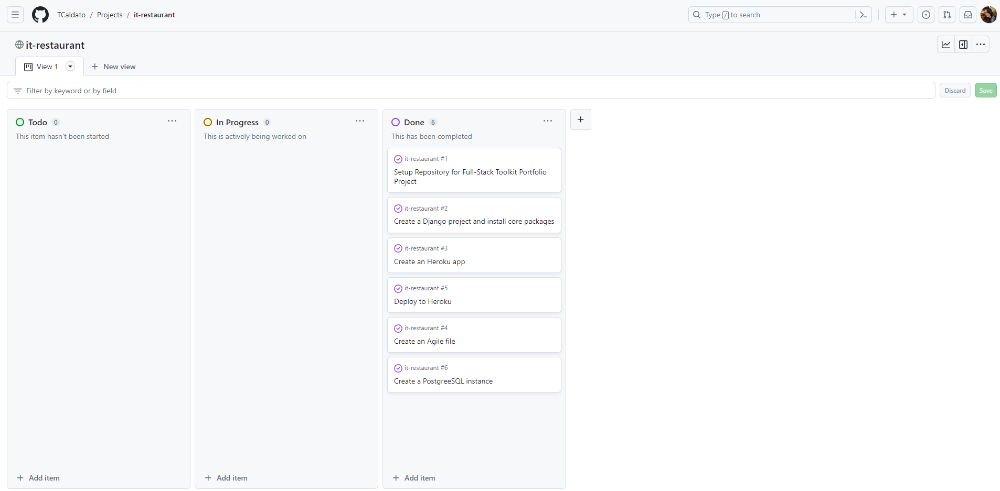

[Back to top](#agile)

## Agile Second Phase 

After all the deployment was completed, I moved on to the second phase of the project, which involved launching the different components of the base.html project. My primary objective was to create a website for a restaurant that would allow customers to make reservations.

### The Second phase included the Tasks:

- Task: Create base.html **#7**
     - Separeted files have to be created for:
         - AC 1: Head
         - AC 2: Navbar
         - AC 3: Footer
         - AC 4: script sub-folder for:
             - Bootstrap and CSS;
             - Jquery and own scripts;

- Task: Components for scripts **#8**
	 - Support for jquery
     - Support for own js

- Task: Components for head **#9**
	 - Support for Bootstrap
     - Support for own CSS
     - Support for Font Awesome

- Task: Components for Navbar **#10**
	 - Home
     - Menu
     - Reservations

- Task: Components for Footer **#11**
	 - Include generic social media links for:
         - Linkedin
         - Facebook
         - Contact Informations with Icons
         - A small comment about the Restaurant

I worked on the HTML main page of my website and it started to take shape. I had started this webpage before while learning how to code using Bootstrap. So, I retrieved the key elements from my previous attempt, which can be checked on my GitHub page [Here](https://github.com/TCaldato/italian-restaurant/tree/main)

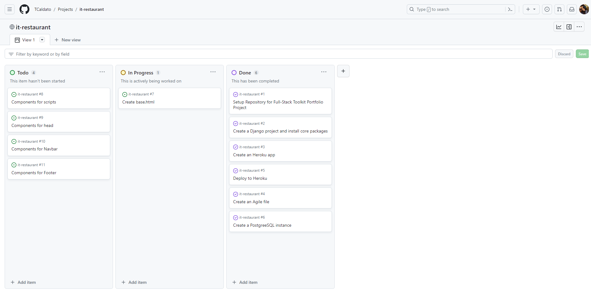

[Back to top](#agile)

## Agile Third Phase 

During this stage, I had setting up some functionalities. After creating the main page, I needed to connect the *admin/* dashboard and establish a top-level static directory to receive the CSS, JS, Summernote, and Images. After, I deployed the system again on Heroku to ensure that everything was working properly.

- Task: Create the Profile Model **#12**
	 - Create a Profile Model to connect it to the admin dashboard.
- Task: Create a top-level static directory **#13**
	 - AC1: Added a CSS directory
     - AC2: Create a style.css file in the css directory.
- Task: Deployment with static files **#14**
- Task: Add images for static files **#15**

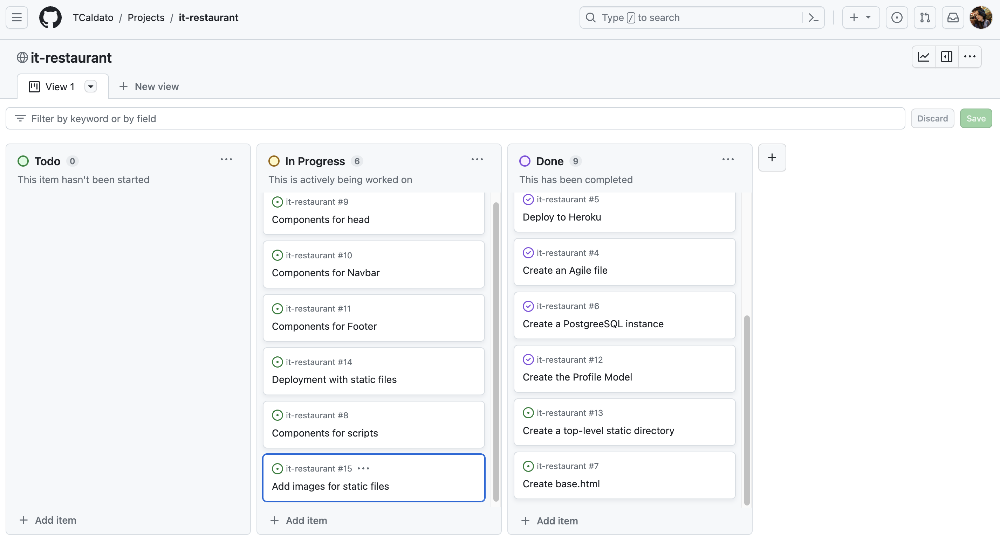

[Back to top](#agile)

## Agile Fourth Phase

During this phase of the project, I started by delving into the User's Stories. Once I had established the basic requirements, I began to address the user's specific requests.
I put myself in the user's view and tried to understand what a customer looks for when using a restaurant webpage.

1. - User Story: Access restaurant Menu **#16**

**As a User I can access the restaurant Menu so that I can know how much I could spend and what I can have to eat**

- AC1: Create a Menu Link on the Navigation Bar
- AC2: Added buttons on the webpage to be easer for customers to access the restaurant Menu

2. - User Story: Table Reservation **#17**

**As a Customer I can reserve a table so that I won't have to wait in the queue**

- AC 1: Add a link on the Navigation bar to Reserve a table
- AC 2: Have a login page with Name and Email for the table confirmation
- AC 3: Have a signup page if this is the first time Customer book a table

In this part, I encountered two bugs. 
The first one was when accessing admin/ after adding the superuser login. So, I had to revise all the course material to find where the issue was:
 
- Admin/ is not working after login, must be fixed
- Added ACCOUNT_EMAIL_VERIFICATION = 'none' and created a new superuser. It fixed the bug

And the seconde bug, After spending some time trying to find the issue, I decided to fix the problem by restarting the Codeanywhere app.

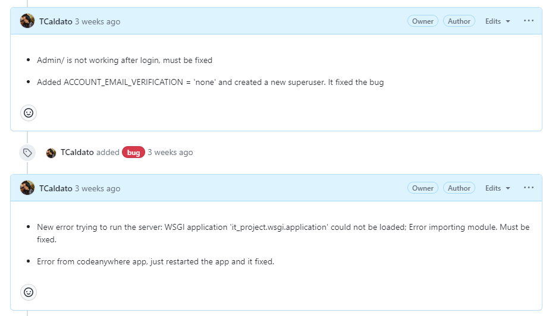

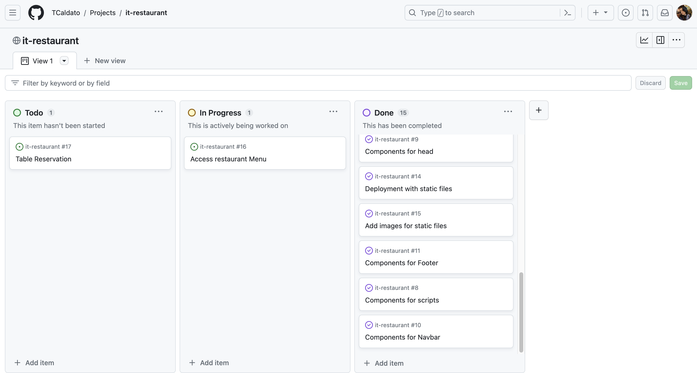

[Back to top](#agile)

## Agile Fifth Phase

During the fifth phase of the Agile approach, my main focus was on building the Reservations page. However, I encountered an issue while trying to access the reservation information. In this part of the project, each customer should be able to view only their own reservation details and have the option to edit or cancel them. Unfortunately, this feature was not working properly, whatever was the user, they had access to all reservations informations.

- Task: Add style to Reservations page **#18**
     - Add Bootstrap to Reservations Page

- User Story: Calendar for tables reservations **#19**

**As a User I can choose a day and time so that I can have a table reserved and don't have to wait in queues**

- AC 1: Have a calendar with days to choose;
- AC 2: Have the possibility to choose a time;
- AC 3: I can verify with my login when I have a table reserved.

I was able to resolve the issue with my brother's help. I had to remove the 'user' field from the ReservationForm and modify the create_booking view to set the user to the currently logged-in user directly. I also had to modify the edit_booking view in the same manner as the create_booking view.

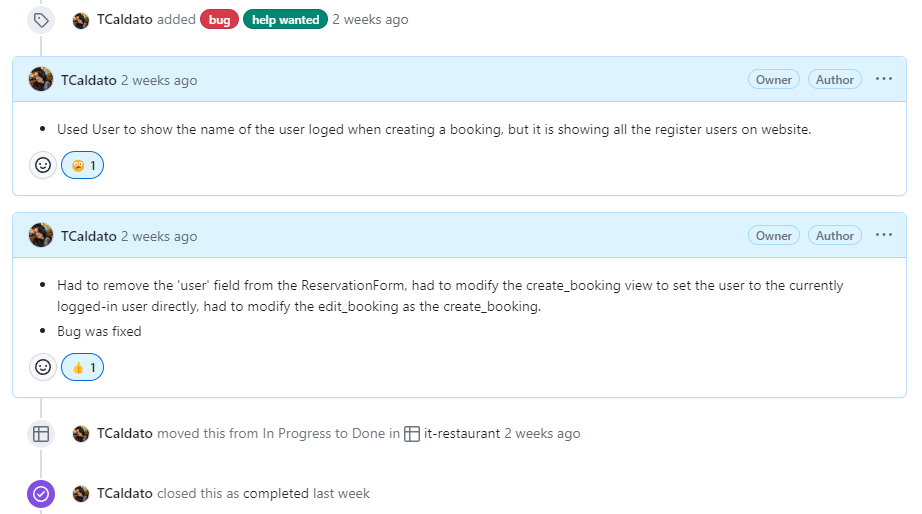

- User Story: User action messages **#20**

**As a User I can see the messagem when I reserve a table so that I know if the action was completed**

- AC 1: Show message on the page when login, logout, booking a table.

Another issue appeared when building the Reservations page, there was an issue with Django messages appearing on the wrong pages. Specifically, all messages were showing on admin/.

I was able to resolve the issue by consulting [Ordinary Coders](https://ordinarycoders.com/blog/article/django-messages-framework-->), who have a great explanation on how to set the messages correctly.

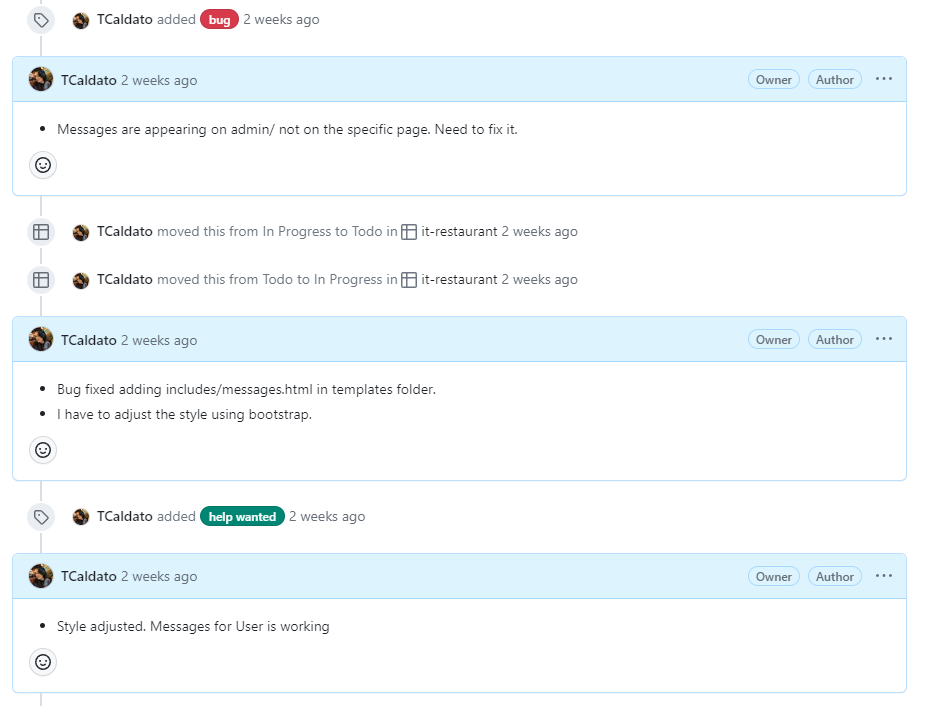

- Task: Fix links to Social media **#21**
	 - Links for social media in the footer are not working, Links have to redirect to social media.

- User Story: Add Reserve a Table in the bottom of the page **#22**

**As a User I can easily find how to reserve a table so that I do not need to spend time looking for it**

- AC 1: Add a section on the bottom of the page with link for reservation
- AC 2: Add in the bottom, an easy link for the Restaurant Menu

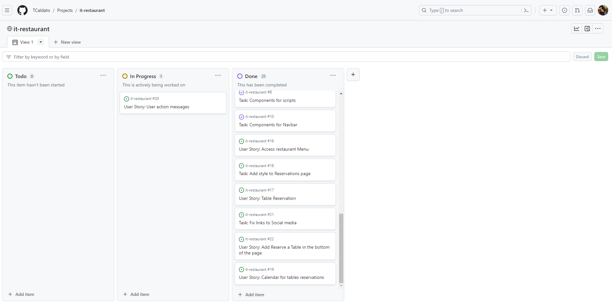

[Back to top](#agile)

## Agile Sixth Phase

For this phase, I focused on enhancing the Reservations, Main, Sign In, Sign Out, and Sign Up pages.

- User Story: Choose how many people booking a table **#23**

**As a User I can choose how many people is going so that I have the right size table for my dinner**

- AC 1: An option to choose the number of people
- AC 2: Admin be able to check how many people is going to dinner

- Task: Change Lorem Ipsum texts for a real restaurant website **#24**

- User Story: Be able to see others reservations **#25**

For this story, as per the suggestion of my mentor Koko, I decided to implement a new feature. The enhancement allows users to view the date, time, and number of people reserved by other users for a particular day. However, they cannot view the names of other users or edit or cancel their bookings.

**As a User I can see others reservations so that a can schedule better my reservation**

- AC 1: Show others reservation;
- AC 2: User have access to cancel or edit only they own booking

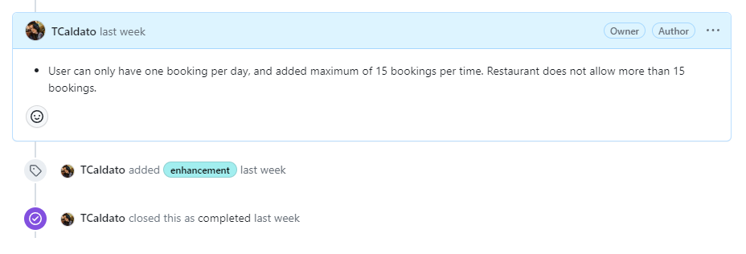

- Task: Add images on different pages **#26**
     - AC 1: Add image on Reservations page and login/logout as well;
     - AC 2: Add image on booking page.

- Tasks: Format and comment HTML, CSS, Python and JS files **#27**

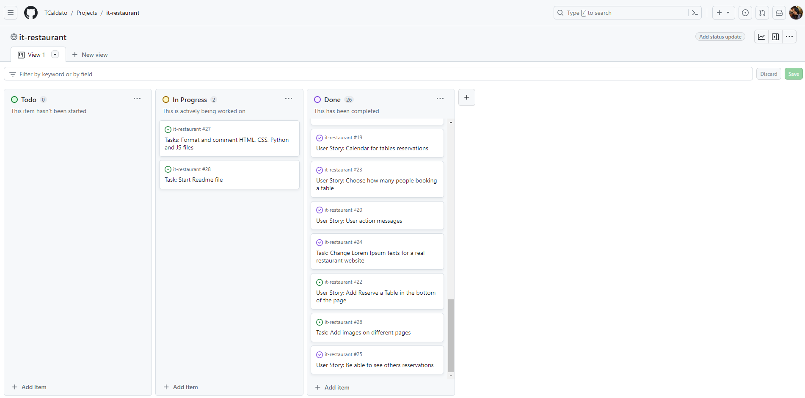

## Agile Seventh Phase

For the final phase, all remaining project documentation was left to be completed.

- Task: Start Readme file **#28**
     - AC 1: Add test file;
     - AC 2:Add folder for images/gifs;
     - AC 3:Add Agile folder for images and text file

- Task: Create a Deployment folder and file for Readme **#29**

- Task: Update the test file for the Readme **#30**

- Task: Start Agile File **#31**

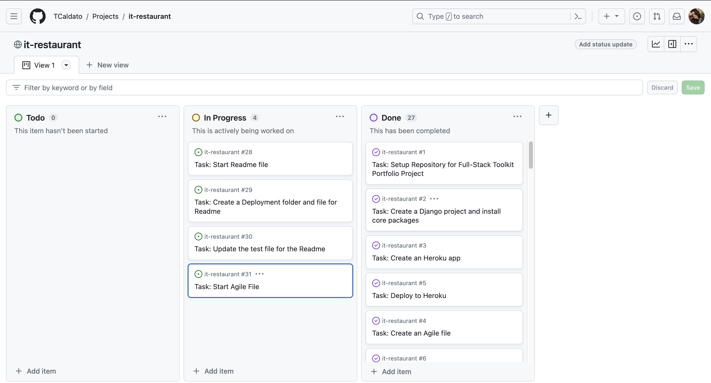

[Back to top](#agile)

Back to Readme file [README.md](README.md)
