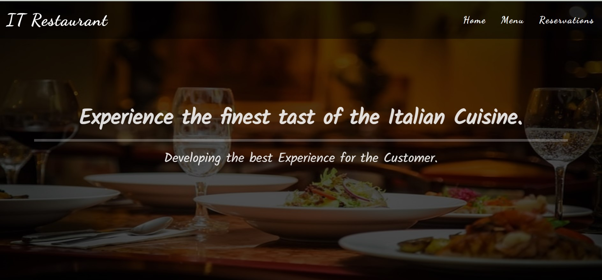
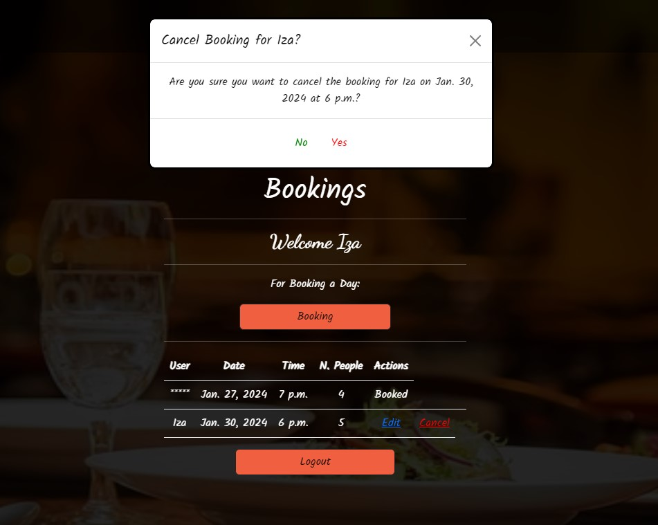

- **Readme still in development**

# IT Restaurant

Step into the heart of Italy with our Italian restaurant website, a digital showcase of culinary excellence crafted using HTML, CSS, JS, and Python with the power of Django and Bootstrap frameworks. Immerse yourself in the flavors of Italy as you navigate through a visually stunning and user-friendly interface, mirroring the warmth of Italian hospitality. Explore our menu and experience the fusion of technology and tradition, all at your fingertips. Buon appetito!

[View the live project here](https://it-restaurant-42ee32c14928.herokuapp.com/)

## Table of contents

1. [Introduction](#introduction)
    1. [About the Project IT Restaurant](#about-the-project-it-restaurant)
2. [UX](#ux)
    1. [User Stories](#user-stories)
    2. [Design Thinking](#design-thinking)
    3. [Intuitive Design](#intuitive-design)
    4. [Database Design](#database-design)
3. [Features](#features)
    1. [The Landing Page](#the-landing-page)
    2. [Main Page Content](#main-page-content)
    3. [Footer](#footer)
    4. [Menu](#menu)
    5. [Reservations](#reservations)
    6. [Alerts](#alerts)
    7. [Future Features](#future-features)
4. [Technologies Used](#technologies-used)
    1. [Languages](#languages)
    2. [Frameworks, Libraries and Programs Used](#frameworks-libraries-and-programs-used)
5. [Testing](#testing)
6. [Issues and Bugs](#issues-and-bugs)
    1. [Remaining Bugs](#remaining-bugs)
7. [Deployment](#deployment)
8. [Credits](#credits)
9. [Acknowledgements](#acknowledgements)

# Introduction

## About the Project IT Restaurant

A Full-Stack website was developed for this project, which utilizes business logic to manage a centralized dataset. A role-based access authentication mechanism was implemented to ensure secure access to the website's data. The website was built using a combination of HTML, CSS, JavaScript, Python, and the Django and Bootstrap frameworks, with Postgres serving as the relational database. An Agile approach was employed throughout the project. The project also involved the implementation of authorization, authentication, and permission features in a Full-Stack web application solution. Furthermore, the project utilized object-based software concepts to achieve its goals.

## UX

### User-Stories

In the Agile approach, a "user story" is a technique that assists in capturing the user's perspective and needs. It is a simple, yet powerful tool that shifts the focus from documenting requirements to discussing them. A user story is a brief, informal description from a user's point of view that explains what they want to achieve with the product. It encourages collaboration between the development team and the user, as it sparks meaningful conversations about the features and functionality that the user story represents. This approach promotes a better understanding of the user's needs, resulting in a product that meets their requirements and delivers value to the user.

The Agile User Story technique has been documented in a separate file. You can check by on [Agile file](AGILE.md)

### Design Thinking

In order to optimize user experience on the developed website, it is important to apply a Design Thinking approach to determine the most useful features. However, given the time constraints of a hard deadline, it is necessary to assess the feasibility of a student developer delivering prioritized features. It is worth mentioning that the project must incorporate CRUD functionality, as per the assessment criteria, which provides a broad outline of the fundamental requirements.

During a preliminary brainstorming session, a few ideas were suggested to enhance the website's user experience:

| Feature                                 | Importance | Feasibility |
|:----------------------------------------|:----------:|:-----------:|
| Create personal account                 | 5          | 5           |
| Update account information              | 5          | 5           |
| Make an appointment                     | 5          | 5           |
| Review latest appointment date/time     | 3          | 4           |
| Able to change/cancel an appointment    | 3          | 4           |
| Send client booking detail via email    | 2          | 2           |
| View history of all appointments made   | 2          | 3           |
| Owner has a view of reservations made   | 4          | 4           |
| **Overall Score**                       | **29**     | **32**      |

The analysis of the feasibility and importance scores indicates that the project is both practically achievable and highly valuable. Therefore, based on the data, the project is deliverable.

### Intuitive Design

The primary objective was to develop a restaurant website that is easy to use and navigate. To achieve this, several crucial factors were taken into account. 

Firstly, it was essential to choose an attractive layout that is simple to navigate. One approach used was to keep the navigation bar at the top of the page, where it can be easily accessed by users. Additionally, all pages and buttons were labeled with clear and concise titles that accurately describe their content. For instance, "Home," "Menu," and "Reservations." 

Another key aspect to consider is consistency in the website's design across all pages. This was achieved by maintaining the same font, color scheme, and size throughout the entire site. By keeping a consistent design, a cohesive and intuitive website was created that is easy for users to comprehend and navigate. 

Finally, the website was optimized for different devices, including desktops, laptops, tablets, and smartphones. This was accomplished using responsive design techniques that automatically adjust the website's layout depending on the user's device. By optimizing the website for various devices, a seamless user experience was provided to all visitors, regardless of the platform they use.

### Database Design

When working with Django, it's important to have a clear understanding of the database architecture before creating models. This is where Entity Relationship Diagrams come in handy as they allow you to visualize the relationships between different tables. By doing so, it is possible save valuable time later on in the project by avoiding the need to recode. Fortunately, the system is quite simple and requires only two tables to be set up correctly.

[Back to top](#it-restaurant)

## Features

### The Landing Page

When Users arrive at the restaurant's landing page, they will immediately notice the Navigation bar on the top of the page. The Navigation bar is designed to be easy to use, with the restaurant's name on the left-hand side and on the right-hand side three important links. These links include the Home link, which will redirect users back to the landing page, the Menu link, which provides a downloadable PDF file of the restaurant's menu, and the Reservations link, which redirects users to the booking webpage. 
    
In addition to the Navigation bar, the landing page will also feature a welcoming message addressed to the customer and also include a photograph of a delicious dish from the restaurant.

[Back to top](#it-restaurant)

### Main Page Content

The main page of the restaurant is divided into three sections: Our Story, Our Food, and Reserve a Table. 

The Our Story section has a small text that explains about the restaurant. 

The Our Food section has three identical parts consisting of a picture of a dish, a brief description of the restaurant and its dishes, and two buttons - one for the Restaurant Menu and one for Reservations. These buttons are placed in all three sections to make it easier for the users to find what they need - the restaurant's menu and how to book a table.

The Reserve a Table section is designed to draw attention to the Menu Button and Reservations.

### Footer

In the footer section, there are four parts. The first part displays the name of the restaurant along with a phrase. The second part is "Discover" and includes links to the menu and reservation pages. The third part is "Contact" and displays restaurant information such as the address and ways to contact them. The last part is "Social" and includes links to the restaurant's Facebook and Instagram pages.

[Back to top](#it-restaurant)

### Menu

The Menu link provides a downloadable PDF file of the restaurant's menu.

### Reservations

#### Sign Up or Sign In

When customers visit the reservations webpage, they will be presented with the option to either Sign Up or Sign In. If it is their first time accessing the restaurant site, they can click on the "Sign Up" button to create a new account. If they are returning customers who have already registered with us, they can choose to Sign In.

- **Sign Up Page**

There is a Sign up form for new customer. It is a Standard allauth sign up page adapted to the site's theme.

- **Sign In Page**

There is a Sign In form to be filled in. Also is a Standard allauth sign in page adapted to the site's theme.

[Back to top](#it-restaurant)

#### Already Registered Customer

When a customer is signed in, they will have access to the Booking webpage. On this page, they will find information about their own reservation along with two options - one to edit the booking they have already made and the other to cancel it. They will also be able to view information about other reservations, but they will not have the options to edit or cancel them. It's important to note that customers will not have access to the names of other customers. They will only have access to information such as the date, time, and number of people booked. It is intended that they use this information to book an appointment that doesn't overlap with an existing one.

On this same webpage, there will be two buttons available: one for booking and the other for logging out.

- **Booking Page**

On the booking page, users can select a date and time to reserve a table at the restaurant. The available timeslots are between 6:00 PM to 9:30 PM. To make things simpler, the form includes an HTML date picker and dropdown menus with options that are based on the booking model. This helps to streamline the data entry process.Users can also specify the number of people coming along, with a maximum limit of 10 people. If the number of guests exceeds 10, they will need to contact the restaurant directly for reservations. There are two buttons available on the page, one to submit the reservation and the other to go back to the reservations webpage.

- **Edit Page**

The Edit page contains the same information as the booking page. Users can modify the date, time, and number of guests(limited to 10 guests).

- **Cancel Modal**

When users try to cancel a booking, a modal window will appear, prompting them to confirm their choice by selecting either "Yes" or "No."

- **Sign out**

Users can log out of their page by clicking on the Logout button on the Reservations page. This will redirect the user to a confirmation page.

### Alerts

The site has been designed using the Django framework, which enables the implementation of customised alerts that are tailored to the needs of the user. These alerts provide valuable feedback to the user. The use of Django also ensures that the alerts are delivered in a consistent and reliable manner, enhancing the overall user experience.

### Future Features

This was my first time using Allauth, and it more than satisfied most of my project requirements. With Allauth, the user can easily edit, update, and delete their bookings in the front-end, which was the main priority of this project. However, one improvement that could be made in the future is to extend Allauth Forms to include the Profile Model, but this wasn't feasible due to time constraints.

Another improvement that would be beneficial for this project is to add an email booking confirmation, which would send a personalized email to the user with the date, time, and number of people booked.

Finally, it would be great to add a space for customers to leave their reviews about the restaurant.

[Back to top](#it-restaurant)

## Technologies Used

### Languages

- [HTML5](https://en.wikipedia.org/wiki/HTML5 "Link to HTML Wikipedia")
- [CSS3](https://en.wikipedia.org/wiki/Cascading_Style_Sheets "Link to CSS Wikipedia")
- [Python](https://en.wikipedia.org/wiki/Python_(programming_language) "Link to Python Wikipedia")
- [JavaScript](https://en.wikipedia.org/wiki/JavaScript "Link to JS Wikipedia")

### Frameworks, Libraries & Programs Used

- [GitHub](https://github.com/)
- [Heroku](https://id.heroku.com/)
- [Python3 ](https://docs.python.org/3/) with the following modules:
     - asgiref==3.7.2
     - backports.zoneinfo==0.2.1;python_version<"3.9"
     - dj-database-url==2.1.0
     - Django==5.0.1
     - django-allauth==0.59.0
     - django-summernote==0.8.20.0
     - gunicorn==20.1.0
     - oauthlib==3.2.0
     - psycopg2==2.9.6
     - PyJWT==2.3.0
     - python3-openid==3.2.0
     - requests-oauthlib==1.3.1
     - whitenoise==6.6.0
     - sqlparse==0.4.4
- [Bootstrap](https://getbootstrap.com/)
- [JQuery](https://jquery.com/) 
- [Django](https://www.djangoproject.com/)
- [Django Templating](https://docs.djangoproject.com/en/4.0/ref/templates/language/)
- [PostgreSQL](https://www.postgresql.org/)
- [Font Awesome](https://fontawesome.com/)
- [LucidChart](https://www.lucidchart.com/pages/)
- [Grammarly](https://app.grammarly.com/)
- [Allauth](https://django-allauth.readthedocs.io/en/latest/)
- [Chrome DevTools](https://developer.chrome.com/docs/devtools/)
- [W3C Markup Validator](https://validator.w3.org/)
- [Jigsaw](https://jigsaw.w3.org/css-validator/)
- [JSHint](https://jshint.com/)
- [PEP8](https://www.pythonchecker.com/)

[Back to top](#it-restaurant)

## Testing

This process has been documented separately in [Testing](testing.md)

## Issues and Bugs

While developing the restaurant website, I encountered several errors and bugs that I had to seek help for on the internet. Listed below are some of them:

- Bug 1:

    During the first deployment to Heroku, I encountered a bug. I am using the CodeAnywhere platform and when deploying to Heroku, I received an error related to **Ubuntu** on requirements file. Upon further investigation, I discovered that when using **pip3 freeze > requirements.txt**, the Ubuntu requirements were being saved. After researching this issue, I found that it is better to only keep in the requirements file what is actually going to be used. Therefore, I removed everything that was not planned to be used, especially the Ubuntu-related requirements, and it worked.

- Bug 2:

    While deploying my static files, I noticed that none of the images I had uploaded on Condeanywhere were showing up on Heroku. After spending some time trying to solve the problem, I went back to review the course materials and realized that I had forgotten to use the terminal to input the command **python3 manage.py collectstatic**. Once I ran this command, all the images appeared correctly on Heroku.

- Bug 3: 

    I encountered a third bug while trying to access the admin/ path. The first superuser I created was giving me an error when I tried to log in to the admin/ path. The error message said that the superuser could not be found, and I couldn't find a solution online. To solve the problem, I went back through all the course lessons and realized that I had forgotten to add **ACCOUNT_EMAIL_VERIFICATION = 'none'** to my settings. Once I added this, I created a new superuser before deploying on Heroku. After these changes, I was able to access the admin/ path without any issues. [Issue 17](https://github.com/TCaldato/it-restaurant/issues/17)

- Bug 4:

    The following error occurred due to an issue with the Codeanywhere platform. The error was: **WSGI application 'it_project.wsgi.application' could not be loaded; Error importing module**. I spent a considerable amount of time searching for the root cause of the problem, but couldn't find anything. Eventually, I gave up and, I decided to just restart the platform and reinstall all the packages. This solution worked and the error was resolved. [Issue 17](https://github.com/TCaldato/it-restaurant/issues/17)

- Bug 5:

    When attempting to view the bookings already made, the user names were being displayed alongside the reservation information, causing a data security problem. To rectify this situation, I sought help from my brother. Together, we discovered that I had used the *User* field to display the name of the **logged-in user** when creating a booking, which was displaying all registered users on the website. To fix this, I removed the *user* field from the ReservationForm, modified the create_booking view to set the user to the currently logged-in user directly, and modified the edit_booking in the same way as create_booking. As a result of these changes, the user names are now hidden, and only the reservation date, time, and number of people are displayed for all users. [Issue 19](https://github.com/TCaldato/it-restaurant/issues/19)

- Bug 6:

    All the alerts from the Django framework were displaying on the *admin/* path instead of specific pages when a user completed an action. To address this issue, I came across a helpful explanation on [Ordinary Coders](https://ordinarycoders.com/blog/article/django-messages-framework). It taught me how to correctly resolve the problem. [Issue 20](https://github.com/TCaldato/it-restaurant/issues/20)

- Bug 7:

    While I was reviewing and testing the code for final improvements, I encountered an error. When I tried to access the edit_booking as a Superuser, it threw a *Not Found The requested resource was not found on this server.* error. I checked the views_reservations.html and edit_booking.html files, and they appeared to be correct. However, after checking the views.py file, I found that the edit_booking was not allowed to be accessed by a Superuser. To fix this, I added the following code: *if not (request.user == booking.user or request.user.is_superuser):* to check if the user is either the owner of the booking or a Superuser before allowing access to the edit form. [Issue 25](https://github.com/TCaldato/it-restaurant/issues/25)

[Back to top](#it-restaurant)

### Remaining Bugs

- There are no remaining bugs found.

## Deployment

The site was deployed early closely following Code Institute guides.

This process has been documented separately in [Deployment](deployment.md)

## Credits

- [Pixabay](https://pixabay.com/) - Link to Pixabay for Free Images.
- [Free Formatter](https://www.freeformatter.com/) - Link for Free Formatter for formatting all codes.

Various sources were consulted to gain a better understanding of the code being implemented. The following sites were most frequently utilized:

- [Stack Overflow](https://stackoverflow.com/) - Link to Stack Overflow page, used for all questions related with the codes.
- [W3Schools](https://www.w3schools.com/) - Link to W3Schools page, used especially for CSS search.
- [Python Package Index](https://pypi.org/) - Link to Python Package Index page, used for support for Python code.
- [Pytlint Dev Documentation](https://pylint.readthedocs.io/en/latest/index.html) - Link to Pylint page, used for support for Python code.
- [CodeMy.com](https://www.youtube.com/@Codemycom) - Link to YouTube page, used as extra classes for Modules and tables.
- [Geeks for Geeks](https://www.geeksforgeeks.org/) - Link to Geeksforgeeks page, used for support for Python code. 
- [Django Project Forum](https://forum.djangoproject.com/) - Link to Django Project Forum page, used for support for Django.
- [Ordinary Coders](https://ordinarycoders.com/blog/article/django-messages-framework) - Link for Ordinary coders, used for set the Django Alerts.
- [Simple is Better than Complex](https://simpleisbetterthancomplex.com/tutorial/2016/07/22/how-to-extend-django-user-model.html#onetoone) - Link for tutorial Django User Model
- [Becky139/mutts-cuts](https://github.com/Becky139/mutts-cuts) - Link to Becky139, it was used as reference for Readme.

## Acknowledgements

- I am grateful to my tutor Seun for her support throughout my project. Her expert guidance helped me achieve my goals.
- I would like to express my gratitude to my brother Rodrigo for his patience in helping and teaching me during difficult times.

[Back to top](#it-restaurant)