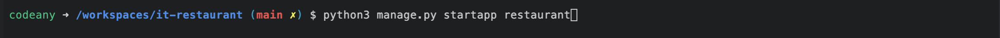

# Deployment

To ensure a smooth submission process, I made an initial effort to deploy this project on Heroku as early as possible. 
This allowed me to work through any potential issues and make necessary adjustments with ample time before the submission deadline.

Below are the detailed steps that were carefully followed to ensure that everything worked seamlessly and without any issues.

### Deploying on GitHub Pages

To deploy this page to GitHub Pages from its GitHub repository, the following steps were taken:

 1. Log into GitHub or create an account.
 2. Locate the GitHub Repository.
 3. At the top of the repository, select Settings from the menu items.
 4. Scroll down the Settings page to the "Pages" section.
 5. Under "Source" click the drop-down menu labeled "None" and select "Main".
 6. Upon selection, the page will automatically refresh meaning that the website is now deployed.
 7. Scroll back down to the "Pages" section to retrieve the deployed link.

### GitHub Forking and Cloning

To fork and clone the project, you can get more information on  you will need to follow these steps:

1. Forking a GitHub repository.

    You might fork a project to propose changes to the upstream, or original, repository. In this case, it's good practice to regularly sync your fork with the upstream repository. To do this, you'll need to use Git on the command line.
    - Navigate to the repository you wish to fork.
    - In the top-right corner of the page, click Fork.
    - Under "Owner," select the dropdown menu and click an owner for the forked repository.
    - By default, forks are named the same as their upstream repositories. Optionally, to further distinguish your fork, in the "Repository name" field, type a name.
    - Optionally, in the "Description" field, type a description of your fork.
    - Click Create fork.

2. Cloning your forked repository.

    - Navigate to your forked repository.
    - Above the list of files, click 'Code'.
    - To clone the repository using HTTPS:
        - Under "Clone with HTTPS", click the copy icon (a clipboard).
    - To clone the repository using an SSH key, including a certificate issued by your organization's SSH certificate authority:
        - Click 'Use SSH', then click the copy icon.
    - To clone a repository using GitHub CLI:
        - Click 'Use GitHub CLI', then click the copy icon.
    - Open Git Bash.
    - Change the current working directory to the location where you want the cloned directory.
    - Type git clone, and then paste the URL you copied earlier. It will look like this:
        git clone https://hostname/YOUR-USERNAME/repo-name
    - Press Enter. Your local clone will be created.

### Deploying on Heroku

In order to deploy a basic application on Heroku using Github, the following steps were taken:

1. Install Django with required packages
2. Create a new Django project
3. Set up project to use a relational database (PostgreSQL)
4. Deploy empty project to Heroku

## Install Django with required packages.

*Django*, a full stack framework will support this project.

To install, type *pip3 install 'Django'* into the terminal.

Install gunicorn (web server) by typing *pip3 install gunicorn*.

Install the dj_database_url library for postgreSQL by typing *pip3 install dj_database_url*, then install the psycopg2 library for postgreSQL by typing *pip3 install psycopg2-binary*.

Create a requirements.txt file in the main directory. 

In the terminal, type *pip3 freeze --local > requirements.txt*.  This file tells Heroku what packages are needed to run the deployed application.  Follow this step each time a new package is installed.

## Create a new Django project.

I created a new *project* called *it_project* typing the following to the terminal, `django-admin startproject it_project`
This will create new folder called `it_project` and a `manage.py` file in the root directory.

Next step, I created an app called `restaurant` within the project. Type *python3 manage.py startapp restaurant*. This app will act as the homepage.

After I opend the `settings.py` file in the `it_project` **project** folder and add the newly created *it_project* app to the bottom of the Installed Apps list. (Add a comma to the end even though it's the last list entry.)

In the terminal, type *python3 manage.py migrate* to update the database schema used by Django.  

In the terminal, type *python3 manage.py runserver* to verify local deployment.  A message to open a page in the browser pops up using *port 8000*.

## Set up project to use a relational database (PostgreSQL)

