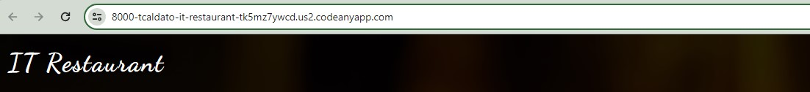

# Testing

## Table of contents

1. [Introduction](#introduction)
2. [UX](#ux)
    1. [User Stories](#user-stories)
    2. [Design Thinking](#design-thinking)
    3. [Intuitive Design](#intuitive-design)
    4. [Database Design](#database-design)
3. [Features](#features)
    1. [The Landing Page](#the-landing-page)
    2. [Main Page Content](#main-page-content)

## Introduction

In order to ensure that the project is executed according to the plan, a comprehensive set of tests were conducted to achieve the desired objectives. The tests were aimed at assessing the functionality, performance and reliability of the project, and to identify any issues that could potentially impact its success. The results of the tests were carefully analyzed and used to refine the project plan.

## Manual Testing

### 1. Deployed website is working

To ensure the live project works properly, I followed all the steps that were provided by the Code Institute course. These steps are well documented in the latter sections of the [Deployment](deployment.md).

### 2. Site opens on the homepage

To ensure that the deployed site opens on the homepage, it was created a function-based view in the restaurant app and added a path in the URL file of the restaurant app. Then, referenced the restaurant app URL in the it_project URL file.

- **restaurant/views.py:**

- **restaurant/urls.py:**

- **it_project/urls.py:**

- **browser**

### 3. CSS file is conected

Ensure that my own css and js files are linked correctly to base.html via head.html and scripts.html. These component files are inserted to base.html using Django Templates.

- **Created my own file CSS**

- **Linked on base.html**

- **Added on the top of base.html**

- **Created static/js**

- **Added script.js on base.html**

- **Added Bootstrap on base.html**

