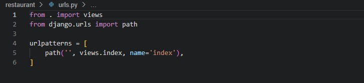

# Testing

## Table of contents

1. [Introduction](#introduction)
2. [Manual Testing](#manual-testing)
    1. [Deployed website is working](#deployed-website-is-working)
    2. [Site opens on the homepage](#site-opens-on-the-homepage)
    3. [CSS file is conected](#css-file-is-conected)
    4. [base.html is linked](#base.html-is-linked)
    5. [Load index.html and base.html](#load-index.html-and-base.html)
    6. [Check allauth working](#check-allauth-working)
    7. [Create and Migrate a Module](#create-and-migrate-a-module)
    8. [Buttons and Links](#buttons-and-links)
    9. [Sign In, Edit, Cancel and Sign Out](#sign-In,-edit,-cancel-and-sign-out)
3. [Validation](#validation)
4. [Lighthouse](#lighthouse)
5. [Browsers](#browsers)

## Introduction

In order to ensure that the project is executed according to the plan, a comprehensive set of tests were conducted to achieve the desired objectives. The tests were aimed at assessing the functionality, performance and reliability of the project, and to identify any issues that could potentially impact its success. The results of the tests were carefully analyzed and used to refine the project plan.

## Manual Testing

### 1. Deployed website is working

To ensure the live project works properly, I followed all the steps that were provided by the Code Institute course. These steps are well documented in the latter sections of the [Deployment](deployment.md).

[Back to top](#testing)

### 2. Site opens on the homepage

To ensure that the deployed site opens on the homepage, it was created a function-based view in the restaurant app and added a path in the URL file of the restaurant app. Then, referenced the restaurant app URL in the it_project URL file.

- **restaurant/views.py:**

- **restaurant/urls.py:**

- **it_project/urls.py:**

- **browser**

[Back to top](#testing)

### 3. CSS file is conected

Ensure that my own css and js files are linked correctly to base.html via head.html and scripts.html. These component files are inserted to base.html using Django Templates.

- **Created my own file CSS**

- **Linked on base.html**

- **Added on the top of base.html**

- **Created static/js**

- **Added script.js on base.html**

- **Added Bootstrap on base.html**

[Back to top](#testing)

- **Collectstatic**

I included django.contrib.staticfiles in my INSTALLED_APPS in Setting. And Added:

On the Terminal I imput the command **python3 manage.py collectstatic**

- **Deleted DISABLE_COLLECTSTATIC**

I excluded DISABLE_COLLECTSTATIC on Heroku's Config Vars. I used the command to push to GitHub and everything was working. 

[Back to top](#testing)

### 4. base.html is linked

The main content is in *restaurant/template/restaurant/index.html*, and to ensure that base.html is included on index.html and in all the others html files, it is added on the top of the html files:

Following the ** in the end of the page content.

### 5. Load index.html and base.html

After everything is connected the page loads normally:

### 6. Check allauth working

Allauth handled signup/login/logout. If User is not authenticated the Sign In and Sign up button will apper.

If the user is authenticated, their personal pages will be displayed instead of Sign In/Sign Up page.

If User is not authenticated, They can Sign Up or Sign In:

.

The authentication can be cheked on *reservatios/template/reservations/view_reservations.html:

It is possible to check the resistration on *admin/* as well.

[Back to top](#testing)

### 7. Create and Migrate a Module

- Type *python3 manage.py makemigrations --dry-run* to view unexecuted effect. These are the instructions to build a table.
- Remove the  *--dry-run* flag to perform the action.
- Use the *python3 manage.py showmigrations* command to see a list of existing migrations.
- To build the table in the backend type *python3 manage.py migrate* into the terminal.

The model must be registered within the apps admin file:

How Profile is a different table to User, it was added to the top of the models file *import post_save and reciever*:

[Back to top](#testing)

### 8. Buttons and Links

All buttons and links are working:

- Reservations buttons:

- Reservations buttons:

### 9. Sign In, Edit, Cancel and Sign Out

- Once a user is signed in, they are authorized to access the booking system. As a result, they can see **only** their own name, but they also have the ability to view other bookings date and time of the reservation, as well as the number of people who will be attending.

- The Edit button and cancel Model is working as well:

- The Sign Out Button tested too:

[Back to top](#testing)

## Validation

Passed in all validators below:

### HTML Validation

[W3C Markup Validator](https://validator.w3.org/)

### CSS Validation

[Jigsaw](https://jigsaw.w3.org/css-validator/)  

### JS Validation

[JSHint](https://jshint.com/) 

### Python Validation

[PEP8](https://extendsclass.com/python-tester.html/ "Python Validator")

Tested all Python codes and all of them passed:

[Back to top](#testing)

## Lighthouse

## Browsers

- Chrome:

- Edge:

- Firefox:

- Opera:

[Back to top](#testing)

Back to Readme file [README.md](README.md)

